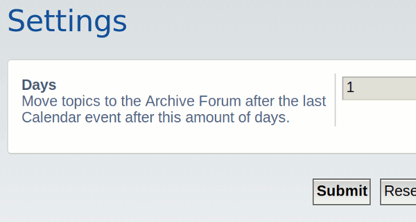
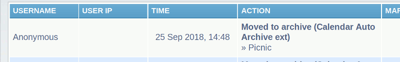

# PhpBB Extension - marttiphpbb Calendar Auto Archive

[Topic on phpBB.com](https://www.phpbb.com/community/viewtopic.php?f=456&t=2487566)

## Requirements

* phpBB 3.2.1+
* PHP 7.1+
* phpBB extension [Archive Forum](https://github.com/marttiphpbb/phpbb-ext-archiveforum)
* phpBB extension for [Calendar Storage](https://github.com/marttiphpbb/phpbb-ext-calendarmono/blob/master/doc/calendar-set.md), [Calendar Mono](https://github.com/marttiphpbb/phpbb-ext-calendarmono) or [Calendar Poly](https://github.com/marttiphpbb/phpbb-ext-calendarpoly)
* PHP calendar extension (compiled with --enable-calendar)

When it's not possible for you to have PHP compiled with --enable-calendar see the [PHP Ext Calendar extension](https://github.com/marttiphpbb/phpbb-ext-phpextcalendar) for a solution.

## Features

This phpBB extension moves with a cron task topics to the Archive Forum (defined with the [Archive Forum Extension](https://github.com/marttiphpbb/phpbb-ext-archiveforum)) after the end of the last Calendar Event (defined in the Calendar Storage, [Calendar Mono](https://github.com/marttiphpbb/phpbb-ext-calendarmono) and/or [Calendar Poly](https://github.com/marttiphpbb/phpbb-ext-calendarpoly)) after a configurable number of days.

## Quick Install

You can install this on the latest release of phpBB 3.2 by following the steps below:

* Create `marttiphpbb/calendarautoarchive` in the `ext` directory.
* Download and unpack the repository into `ext/marttiphpbb/calendarautoarchive`
* Enable `Calendar Auto Archive` in the ACP at `Customise -> Manage extensions`.

## Uninstall

* Disable `Calendar Auto Archive` in the ACP at `Customise -> Extension Management -> Extensions`.
* To permanently uninstall, click `Delete Data`. Optionally delete the `/ext/marttiphpbb/calendarautoarchive` directory.

## Support

* Report bugs and other issues to the [Issue Tracker](https://github.com/marttiphpbb/phpbb-ext-calendarautoarchive/issues).

## License

[GPL-2.0](license.txt)

## Screenshot

### ACP

### ACP Admin Log

